## 一、git的安装
### 1.1、命令行方式安装
&emsp;&emsp;1）、下载windows git：https://git-scm.com/downloads
&emsp;&emsp;2）、配置用户信息
&emsp;&emsp;- git config –-global user.name “zxt”
&emsp;&emsp;- git config –-global user.email “2369470057@qq.com”
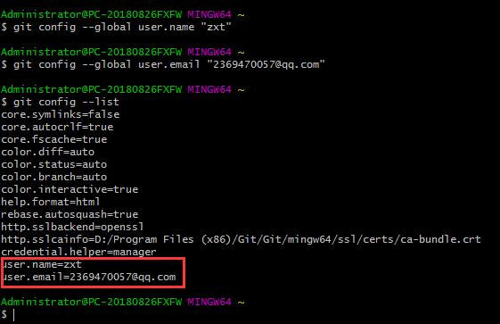
<br/>

### 1.2、git 图形界面安装
&emsp;&emsp;以上是git的命令行方式，也可以使用git的图形界面，例如SourceTree。由于SourceTree个人版本的跳过注册方式已经无效，需要下载企业版本：
&emsp;&emsp;下载地址：https://www.sourcetreeapp.com/enterprise。
&emsp;&emsp;首次点击msi进行安装 （当前最新版SourcetreeEnterpriseSetup_3.0.17.msi），然后在 %programfiles(x86)%\Atlassian\Sourcetree 目录下找到SourceTree.exe 运行后会出现注册界面：

&emsp;&emsp;关掉sourcetree 打开%LocalAppData%\Atlassian\SourceTree，新建文件：accounts.json。


accounts.json内容代码：
```json
[
  {
    "$id": "1",
    "$type": "SourceTree.Api.Host.Identity.Model.IdentityAccount, SourceTree.Api.Host.Identity",
    "Authenticate": true,
    "HostInstance": {
      "$id": "2",
      "$type": "SourceTree.Host.Atlassianaccount.AtlassianAccountInstance, SourceTree.Host.AtlassianAccount",
      "Host": {
        "$id": "3",
        "$type": "SourceTree.Host.Atlassianaccount.AtlassianAccountHost, SourceTree.Host.AtlassianAccount",
        "Id": "atlassian account"
      },
      "BaseUrl": "https://id.atlassian.com/"
    },
    "Credentials": {
      "$id": "4",
      "$type": "SourceTree.Model.BasicAuthCredentials, SourceTree.Api.Account",
      "Username": "",
      "Email": null
    },
    "IsDefault": false
  }
]
```
&emsp;&emsp;然后再运行%programfiles(x86)%\Atlassian\Sourcetree\SourceTree.exe即可跳过注册。
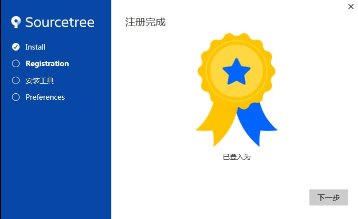
&emsp;&emsp;注册完成SourceTree最终界面如下：
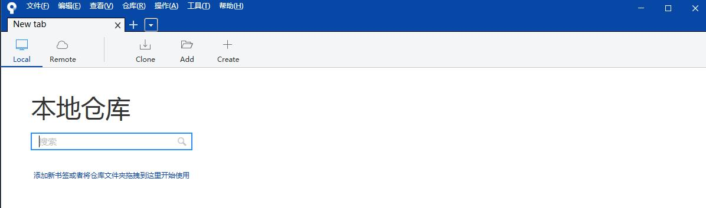
<br/>

### 1.3、git架构
&emsp;&emsp;**1、仓库：** 一个git仓库包含工作目录，与.git目录。其中.git目录是工作目录的下的一级子目录。由于所有版本控制相关信息都在该.git目录下，整个工作目录保持与未版本控制时一样的状态。
&emsp;&emsp;**2、.git目录：** 该目录下包含所有的配置，日志，分支，头(HEAD)等版本控制所需的全部信息。
&emsp;&emsp;**3、工作目录：** 即版本控制管理的对象。是某项工作进行的需要增减文件，变更文件内容等操作所包含于的目录。该目录下的所有文件或目录内容可以被git管理。
&emsp;&emsp;**4、缓存区(Index)：** 主要用来保存下一次需要提交（正式修改）到git仓库中的内容。又称为Cache，Staging Area等。
&emsp;&emsp;**5、提交(Commit)：** 一次提交表示一组针对工作目录内容的修改或操作。例如新增了5个文件，删除了2个，修改了3个。这些修改信息一次性纳入git仓库中，形成了对工作目录整体的新的快照。在git中一次提交即对应于新的快照，即可看作一个临时版本。“提交”总是从缓冲区发出。
&emsp;&emsp;**6、分支(Branch)：** 分支可以看作一个指针，总是指向一个版本树中的一个"提交"。分支帮助用户指示版本树中的某个分支。
&emsp;&emsp;**7、标签(Tag)：** 标签代表了版本历史中的某些特殊点的标识，例如用来标识版本发布点(v1.0，等等)。
&emsp;&emsp;**8、头(HEAD)：** HEAD即指向当前分支的指针。在git操作的命令中HEAD取当前分支指向的"版本"(对应于提交，标签等）。
&emsp;&emsp;**9、文件状态：**
&emsp;&emsp;已修改（Modified） - 文件已修改，且没有存入缓存或者版本库；
&emsp;&emsp;已缓存（Staged） - 文件最新修改已放入缓存区中，但尚未存入版本库；
&emsp;&emsp;已提交（Committed） - 文件最新修改已存入版本库。
&emsp;&emsp;**10、git可管理广义的内容：**
&emsp;&emsp;计算机科学相关的版本管理，各种设计工程的版本管理。
<br/>
<br/>

## 二、git的基本使用
### 2.1、创建仓库
**1、使用git图形界面操作。**
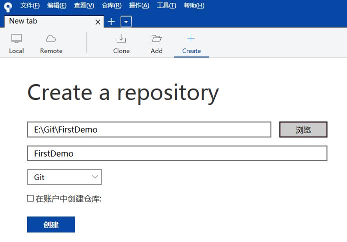
&emsp;&emsp;然后新建文件，编辑保存，提交（commit）。

**2、使用git命令行操作。**
&emsp;&emsp;1、初始化版本库
&emsp;&emsp;-  <font color="red">git init</font>
&emsp;&emsp;什么是版本库呢？版本库又名仓库，英文名repository，你可以简单理解成一个目录，这个目录里面的所有文件都可以被Git管理起来，每个文件的修改、删除，Git都能跟踪，以便任何时刻都可以追踪历史，或者在将来某个时刻可以“还原”。
&emsp;&emsp;git init命令瞬间git就把仓库建好了，可以发现当前目录下多了一个.git的目录，默认是隐藏的，用ls -ah命令就可以看见。
&emsp;&emsp;2、添加文件到版本库
&emsp;&emsp;-  <font color="red">git add</font>
&emsp;&emsp;-  <font color="red">git commit</font>
&emsp;&emsp;git commit命令，-m后面输入的是本次提交的说明，可以输入任意内容，当然最好是有意义的，这样你就能从历史记录里方便地找到改动记录。
&emsp;&emsp;一次可以add多个不同的文件，以空格分隔。
&emsp;&emsp;3、查看仓库状态
&emsp;&emsp;-  <font color="red">git status</font>
&emsp;&emsp;git status命令可以让我们时刻掌握仓库当前的状态。
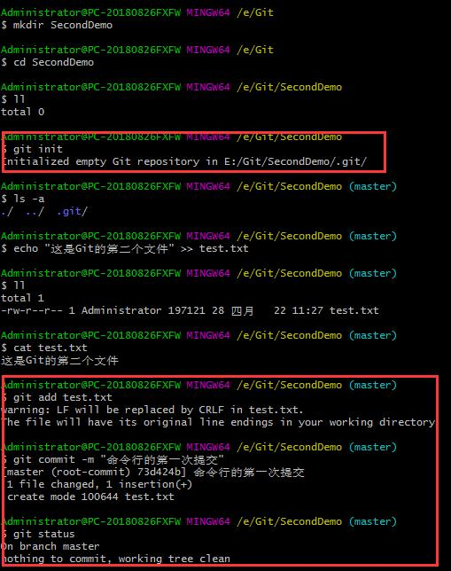

#### 2.1.1、工作区和暂存区
&emsp;&emsp;git和其他版本控制系统如SVN的一个不同之处就是有暂存区的概念。
&emsp;&emsp;工作区就是你在电脑里能看到的目录，工作区里有一个隐藏目录.git，这个不算工作区，而是git的版本库。
&emsp;&emsp;git的版本库里存了很多东西，其中最重要的就是称为stage（或者叫index）的暂存区，还有git为我们自动创建的第一个分支master，以及指向 master的一个指针叫HEAD。
&emsp;&emsp;前面讲了我们把文件往 git 版本库里添加的时候，是分两步执行的：
&emsp;&emsp;<font color="red">**第一步是用git add把文件添加进去，实际上就是把文件修改添加到暂存区；**</font>
&emsp;&emsp;<font color="red">**第二步是用git commit提交更改，实际上就是把暂存区的所有内容提交到当前分支。**</font>
&emsp;&emsp;因为我们创建git版本库时，git自动为我们创建了唯一一个master分支，所以现在git commit就是往master分支上提交更改。
&emsp;&emsp;你可以简单理解为，git add命令实际上就是把要提交的所有修改放到暂存区（Stage），然后执行git commit就可以一次性把暂存区的所有修改提交到分支。一旦提交后，如果你又没有对工作区做任何修改，那么工作区就是“干净”的。

#### 2.1.2、其他常用命令
&emsp;&emsp;4、提交日志
&emsp;&emsp;-  <font color="red">git log</font>
&emsp;&emsp;git log命令显示从最近到最远的提交日志。如果嫌输出信息太多，看得眼花缭乱的，可以试试加上--pretty=oneline参数：git log --pretty=oneline。
&emsp;&emsp;在 Git中，用HEAD表示当前版本，也就是最新的提交commit id，上一个版本就是HEAD\^，上上一个版本就是HEAD\^\^，当然往上100个版本写100个^比较容易数不过来，所以写成HEAD~100。
&emsp;&emsp;现在我们要把当前版本回退到上一个版本，就可以使用git reset命令：
&emsp;&emsp;<font color="red">git reset</font> --hard HEAD\^
&emsp;&emsp;或者 git reset commit id
&emsp;&emsp;5、修改与撤销
&emsp;&emsp;用<font color="red">git diff</font> HEAD -- readme.md命令可以查看工作区和版本库里面最新版本的区别。
&emsp;&emsp;<font color="red">git checkout</font> -- file可以丢弃工作区的修改：git checkout -- readme.md
&emsp;&emsp;命令git checkout -- readme.md意思就是，把readme.md文件在工作区的修改全部撤销，即让这个文件回到最近一次git commit或git add时的状态。
&emsp;&emsp;当然也可以用git reset命令。
&emsp;&emsp;6、删除文件
&emsp;&emsp;一般情况下，你通常直接在文件管理器中把没用的文件删了，或者用rm命令删了：
&emsp;&emsp;<font color="red">rm</font> readme.md
&emsp;&emsp;这个时候，git 知道你删除了文件，因此，工作区和版本库就不一致了，git status命令会立刻告诉你哪些文件被删除了。
&emsp;&emsp;现在你有两个选择，一是确实要从版本库中删除该文件，那就用命令git rm删掉，并且git commit：
&emsp;&emsp;git rm readme.md
&emsp;&emsp;git commit -m "remove readme.md"
&emsp;&emsp;现在，文件就从版本库中被删除了。
&emsp;&emsp;另一种情况是删错了，因为版本库里还有呢，所以可以很轻松地把误删的文件恢复到最新版本：
&emsp;&emsp;git checkout -- readme.md
<br/>

### 2.2、git工作流
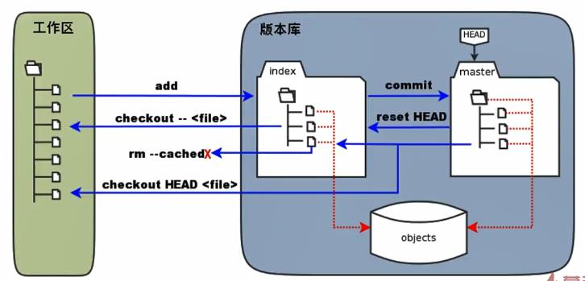
&emsp;&emsp;实际上版本库中所有的数据都保存在objects里面，index（缓存区）与master中保存的都是指向数据的指针。
&emsp;&emsp;git的一般工作流程如下：
&emsp;&emsp;1、git clone 克隆远程资源到本地目录，作为工作目录；
&emsp;&emsp;2、然后在本地的克隆目录上添加或修改文件；
&emsp;&emsp;3、如果远程修改了，需要同步远程的内容，直接git pull就可以更新本地的文件；
&emsp;&emsp;4、本地在修改之后，可以通过git status 查看修改的文件。然后使用git add 添加修改的文件暂到缓冲区；
&emsp;&emsp;5、在添加之后，可以使用git commit添加到当前的工作区；
&emsp;&emsp;6、在修改完成后，如果发现错误，可以撤回提交并再次修改并提交；
&emsp;&emsp;7、git push将本地的修改推送到远程的git服务器。
<br/>

### 2.3、git主要功能
#### 2.3.1、添加远程仓库
&emsp;&emsp;1、创建SSH key：<font color="red">ssh –keygen –t rsa –C youremail@example.com。</font>
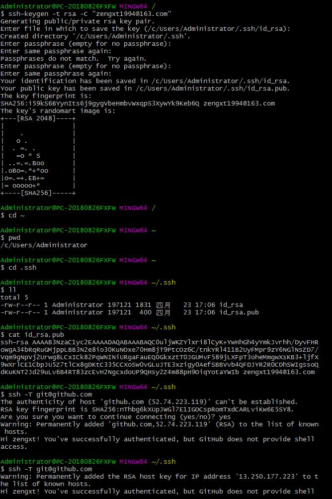
&emsp;&emsp;创建 SSH Key。在用户主目录下，看看有没有.ssh目录，如果有，再看看这个目录下有没有id_rsa和id_rsa.pub这两个文件，如果已经有了，可直接跳到下一步。如果没有，打开 Shell（Windows下打开Git Bash），创建SSH Key：
&emsp;&emsp;ssh-keygen -t rsa -C youremail@example.com
&emsp;&emsp;你需要把邮件地址换成你自己的邮件地址，然后一路回车，使用默认值即可。
&emsp;&emsp;如果一切顺利的话，可以在用户主目录里找到.ssh目录，里面有id_rsa和id_rsa.pub两个文件，这两个就是SSH Key的秘钥对，id_rsa是私钥，不能泄露出去，id_rsa.pub是公钥，可以放心地告诉任何人。
&emsp;&emsp;然后登录GitHub（或者其它Git代码托管平台），打开Account settings，SSH Keys页面，点Add SSH Key，填上任意Title，在Key文本框里粘贴id_rsa.pub文件的内容。
&emsp;&emsp;为什么GitHub需要SSH Key呢？因为GitHub需要识别出你推送的提交确实是你推送的，而不是别人冒充的，而Git支持SSH协议，所以GitHub只要知道了你的公钥，就可以确认只有你自己才能推送。
&emsp;&emsp;当然，GitHub允许你添加多个Key。假定你有若干电脑，你一会儿在公司提交，一会儿在家里提交，只要把每台电脑的Key都添加到GitHub，就可以在每台电脑上往GitHub推送了。
&emsp;&emsp;2、然后将SSH配置到SourceTree的客户端。（工具--->选项）
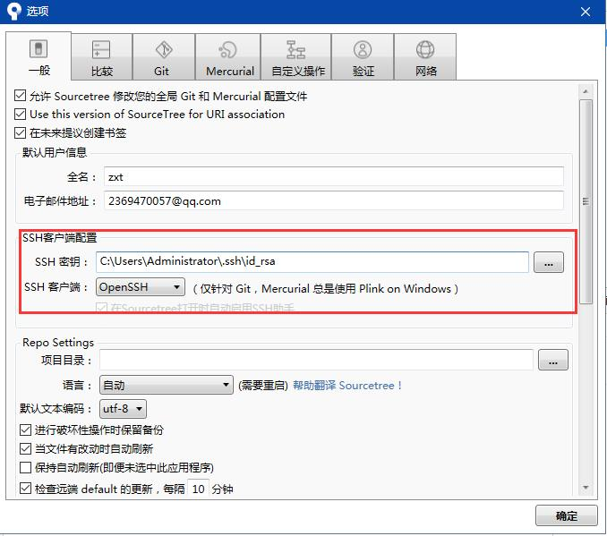
&emsp;&emsp;3、添加远程仓库
&emsp;&emsp;1)、git remote add origin git@github.com
&emsp;&emsp;2)、git pull origin master –allow-unrelated-histories
&emsp;&emsp;3)、git push –u origin master
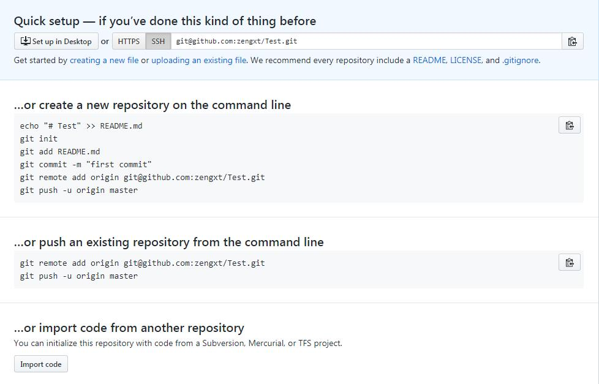

#### 2.3.2、克隆仓库
&emsp;&emsp;克隆远程仓库中的代码到本地：git clone git@github.com:zengxt/Test.git。
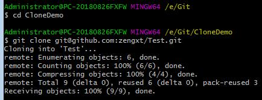

#### 2.3.3、标签管理
&emsp;&emsp;查看所有标签    git tag
&emsp;&emsp;创建标签        git tag name
&emsp;&emsp;指定提交信息    git tag –a name –m  “comment”
&emsp;&emsp;删除标签        git tag –d name
&emsp;&emsp;标签发布        git push origin name
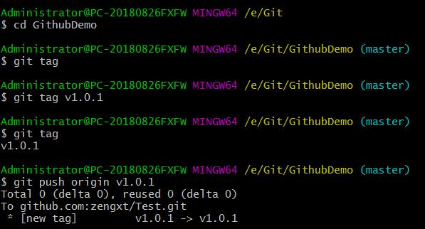
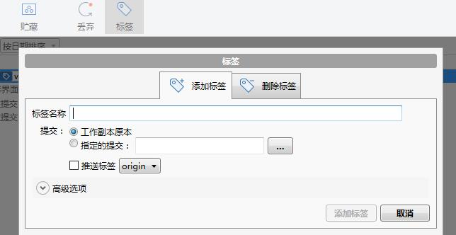

#### 2.3.4、分支管理
&emsp;&emsp;查看分支：git branch
&emsp;&emsp;创建分支：git branch name
&emsp;&emsp;切换分支：git checkout name
&emsp;&emsp;合并分支：git merge name （该命令需要在master分支上运行）
&emsp;&emsp;删除分支：git branch –d name
&emsp;&emsp;分支发布：git push origin name

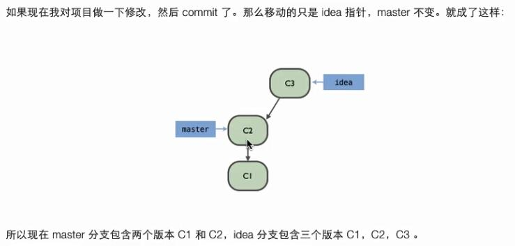
<br/>
<br/>

## 三、理解 Github Flow
&emsp;&emsp;GitHub Flow 是一个非常轻便的，基于分支的工作流。非常适合代码部署非常频繁的团队和项目。
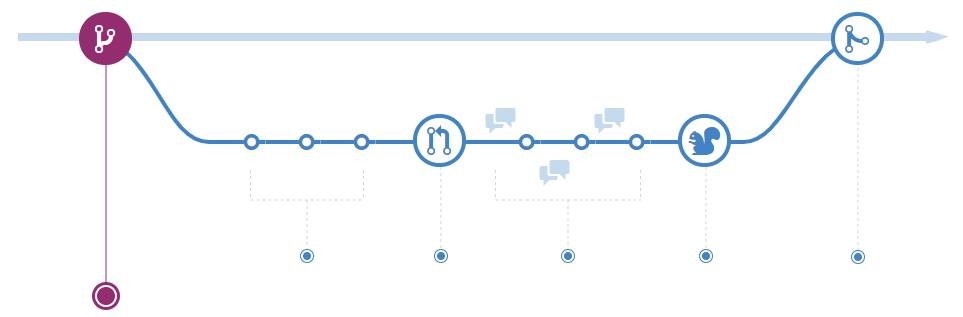
&emsp;&emsp;**1、创建一个分支**
&emsp;&emsp;当你在开发一个项目的时候，一般在同一时刻你会同时开展多个想法，其中一些比较成熟了，另一些还是很初级。有了分支就可以很好的来进行管理了。
&emsp;&emsp;当你在项目中创建一个分支的时候，你正在搭建一个可以尝试新想法的环境。你在新分支上所做的修改不会影响到主（master） 分支，所以你能自由实验和提交修改。在被你的同事审核之前，你的分支是不会被合并的，所以一切都是安全的。
&emsp;&emsp;**深度技巧**
&emsp;&emsp;分支是 Git 的一个核心概念，整个 GitHub Flow 也是基于它的。最重要的规则只有一个：主（master）分支上的任何内容都要保证是可部署的。
&emsp;&emsp;正因为如此，当开发一个新功能或者修复错误的时候，你的新分支独立于主分支是极其重要的。你的分支名应该见名知义（例如，refactor-authentication，user-content-cache-key，make-retina-avatars）， 以便让其他人知道你正在做什么工作。
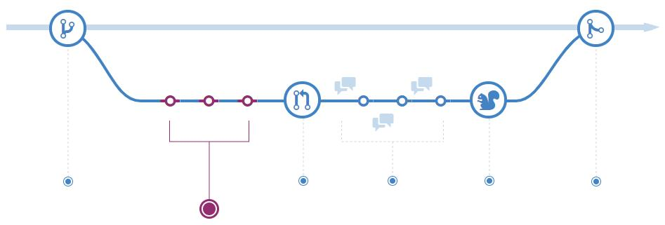
&emsp;&emsp;**2、添加新版本**
&emsp;&emsp;一旦你的分支创建好之后，就可以开始做些修改了。不论何时你添加，编辑或者删除一个文件，你就做一个版本，然后把它们添加到你的分支中。 添加版本的过程就跟踪了你在一个功能分支上的工作进展。
&emsp;&emsp;版本也为你的工作创建了一个透明的历史，其他人可以跟随着去理解你所做的工作以及为什么要这样做。每一个版本都有一条相关联的版本信息， 版本信息是一段描述，解释了为什么要做这样一个特定的修改。此外，每一个版本都可以看作是一个独立的修改单元。这样如果你不小心改错了，或者是改变了开发思路的时候，就可以来回滚修改了。
&emsp;&emsp;**深度技巧**
&emsp;&emsp;版本信息很重要，因为一旦你的修改被推送到服务器上，它们会以一个一个版本的形式显示。 通过书写清楚的版本信息，你可以更容易让其他人跟上你的思路并提供反馈。

&emsp;&emsp;**3、开启一个 Pull Request**
&emsp;&emsp;Pull Request 用来发起对你做的各个版本的讨论。因为 Pull Request 与底层的Git仓库代码是紧密相关的，任何人都能确切地看到一旦他接受了你的 Pull Request 会有那些代码合并进来。
&emsp;&emsp;在开发过程中的任意时点，你都可以开启一个 Pull Request：当你有很少或没有代码，但想要分享一些截图或基本想法的时候， 当你陷入困境需要帮助和建议的时候，或者当你准备好让他人审核你工作的时候。通过在你的 Pull Request 信息中使用 GitHub 的@mention 系统，你可以向特定的人或团队请求反馈，不管他们就在大厅的那边，还是离你有十个时区之遥。
&emsp;&emsp;**深度技巧**
&emsp;&emsp;Pull Requests 对贡献开源项目和管理共享仓库的变动是非常有用的。若你正使用 Fork & Pull 模式，Pull Resquest 提供了一种方式来通知项目维护者你希望他们考虑一下你提交的修改。若你正使用一个共享仓库模式，在提议修改被合并到主分支中之前，Pull Resquest 可以启动对修改代码的审核和讨论。
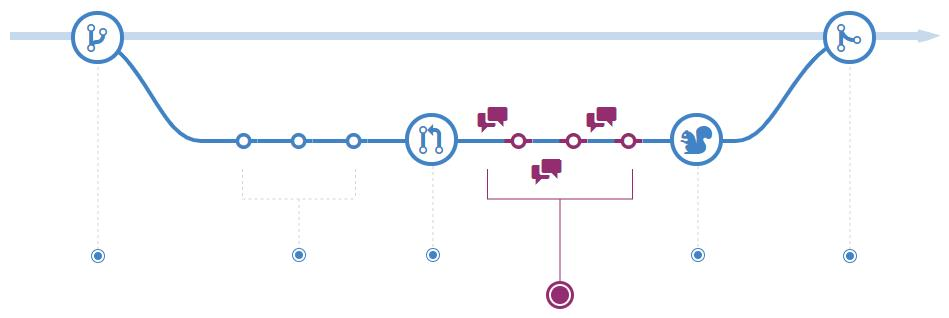
&emsp;&emsp;**4、讨论和代码审核**
&emsp;&emsp;一旦开启了一个 Pull Request，审核你修改的人或团队会来提出问题和评论。有可能是代码风格符不符合项目规范， 也或者代码忘了单元测试，也可能各方面都没问题。Pull Request 就是为了鼓励这种类型的讨论而设计的。
&emsp;&emsp;根据对你所做版本的讨论和反馈，你也可以继续往你的分支上推送代码。若有人评论说你忘记做某件事或你的代码中存在 bug，你可以在你的分支中修复它，并提交这些修改。Github 将会在同一个 Pull Request 中展示你的新修改和任何新的反馈。
&emsp;&emsp;**深度技巧**
&emsp;&emsp;Pull Request 中评论是用 Markdown 格式书写的，所以你可以在评论中嵌入图片和 emoji 表情符号，使用带有格式的文本块，和其它轻量级格式。

&emsp;&emsp;**5、部署**
&emsp;&emsp;使用GitHub，您可以从分支进行部署，以便在合并到master之前进行最终的生产测试。
&emsp;&emsp;一旦您的Pull Resquest被审核并且分支通过了您的测试，您就可以部署您的变更来在生产中验证它们。如果您的分支引发问题，您可以在生产环境中回滚它到master。
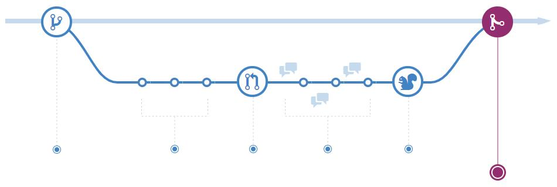
&emsp;&emsp;**6、合并**
&emsp;&emsp;一旦大家审核了你的 Pull Request 并且所有代码通过了测试，就是可以把你的代码合并到主分支了。
&emsp;&emsp;一旦合并之后，Pull Request 会保留代码的历史修改记录。因为它们是可搜索的，它们让人可以回到过去，去理解为什么做这个决定以及怎样做的决定。
&emsp;&emsp;**深度技巧**
&emsp;&emsp;通过在你的 Pull Request 中包含某些特定关键词，你就能用代码关联 issues。在你的 Pull Request 被合并的时候，与其相关的 issues 也会关闭。 例如，输入这个短语 Closes #32 将会关闭仓库中编号为32的 issue。
<br/>
<br/>

## 四、GitHub Pages 搭建网站
&emsp;&emsp;Github Pages 是 github 公司提供的免费的静态网站托管服务，用起来方便而且功能强大，不仅没有空间限制，还可以绑定自己的域名。
&emsp;&emsp;到 https://pages.github.com/上，看到可以创建的网站有两类，一类是为自己或者是自己的组织创建站点，就是新建一个仓库，仓库的名字叫做，username.github.io 或者是 orgnizationname.github.io，注意这里的 username 和 orgnizationname 要严格替换成你自己的用户名或者组织名，大小写也要区分，不然就会有问题。然后就往仓库里面放页面内容就行了。第二类是为项目创建网站，这个其实主要步骤都是一样的，只不过稍微比创建用户或组织网站复杂一点点。
&emsp;&emsp;1、在项目上新建一个gh-pages分支（名字不要写错）。
&emsp;&emsp;2、在这个分支中添加index.html，编写网页内容。
&emsp;&emsp;3、访问：http://username.github.io/projectname/即可。
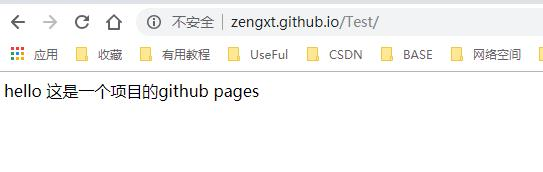
