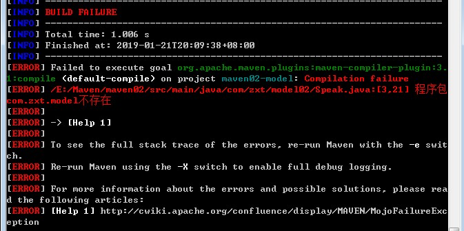

# Maven简单入门

## 一、Maven简介及环境搭建

### 1、Maven简介

&emsp;&emsp;Maven是基于项目对象模型（POM），可以通过一小段描述信息来管理项目的搭建、报告和文档的软件项目管理工具。
&emsp;&emsp;POM是项目对象模型(Project Object Model)的简称，它是Maven项目中的文件，使用XML表示，名称叫做pom.xml。在Maven中，当谈到Project的时候，不仅仅是一堆包含代码的文件。一个Project往往包含一个配置文件，包括了与开发者有关的、缺陷跟踪系统、组织与许可、项目的URL、项目依赖、以及其他。它包含了所有与这个项目相关的东西。事实上，在Maven世界中，project可以什么都没有，甚至没有代码，但是必须包含pom.xml文件。
<br/>


### 2、Maven下载及环境配置
**1）、Maven的官网：http://maven.apache.org/。**


将Maven的压缩包解压之后的目录如下：


- bin目录包含mvn的运行脚本，m2.conf：配置文件；

- boot目录包含一个类加载器的框架，Maven使用它来加载自己的类库；

- conf目录是一些配置文件；
- lib目录下包含一些类库，自己运行的包括第三方的一些类库。
  <br/>

**2）、Maven环境变量的配置：**
M2_HOME变量：


PATH变量：


<br/>

**3）、验证环境变量是否配置成功：**
命令提示符下输入：mvn -v


<br/>

## 二、Maven的Hello world程序
### **1、Maven项目的目录结构**

```java
src
	-main
		-java
			-package
	-test
		-java
			-package
	resources
```
<br/>

### **2、创建项目**


main和test目录下都含有java目录。在main的java目录下，新建类包的目录结构，并编写HelloWorld.java。

```java
package com.zxt.model;

public class HelloWorld {

	public static String sayHello() {
		return "Hello World!!";
	}
}
```
在test的java目录下，新建类包的目录结构，并编写测试类HelloWorldTest.java。

```java
package com.zxt.model;

import org.junit.*;
import org.junit.Assert.*;

public class HelloWorldTest {

	@Test
	public void testSayHello() {
		Assert.assertEquals("Hello World!!", HelloWorld.sayHello());
	}
}
```
<br/>

### **3、pom.xml**

&emsp;&emsp;创建pom.xml文件管理项目（位于项目的根目录下），pom文件的格式可以从其他项目中拷贝过来，例如spring，struts等。

​		<font color='red'>\<groupId> groupId的值就是项目的包名\</groupId></font>

​		<font color='red'>\<artifactId> artifactId是模块的名\</artifactId ></font>

​		<font color='red'>\<version>版本\</version ></font>

```xml
<!-- 项目依赖包的管理 -->
<dependencies>
	<dependency>
		<groupId>junit</groupId >
		<artifactId> junit </artifactId >
		<version>4.12</version >
	</dependency>
</dependencies>
```

```xml
<?xml version="1.0" encoding="UTF-8"?>

<project xmlns="http://maven.apache.org/POM/4.0.0"
         xmlns:xsi="http://www.w3.org/2001/XMLSchema-instance"
         xsi:schemaLocation="http://maven.apache.org/POM/4.0.0
            http://maven.apache.org/xsd/maven-4.0.0.xsd">

	<!-- Maven的版本，固定4.0.0 -->
    <modelVersion>4.0.0</modelVersion>

	<!-- 项目描述 -->
	<groupId>com.zxt.model</groupId>
	<artifactId>maven01-model</artifactId>
	<version>0.0.1-SNAPSHOT</version>

	<!-- 项目依赖包的管理 -->
	<dependencies>
		<dependency>
			<groupId>junit</groupId >
			<artifactId>junit</artifactId >
			<version>4.12</version >
		</dependency>
	</dependencies>
</project>
```
<br/>

### **4、编译运行**

在命令提示符中切换到项目目录，并使用mvn compile命令编译项目：


编译成功后，运行mvn test执行测试用例：


对项目进行打包，mvn package。


<br/>

## 三、Maven常用的构建命令
- <font color="red">mvn –v  </font>查看maven版本；
- <font color="red">mvn compile </font>编译maven项目；
- <font color="red">mvn test </font>运行测试；
- <font color="red">mvn package </font>打包maven项目；
- <font color="red">mvn clean </font>删除target文件（java源代码编译生成的二进制字节码，项目说明文档等）；
- <font color="red">mvn install </font>安装jar包到本地仓库中。

### 1、install命令的使用实例
1）、创建类似于maven01的项目maven02。其源代码及测试代码如下：

Speak.java

```java
package com.zxt.model02;

import com.zxt.model.HelloWorld;

public class Speak {
	
	public static String sayHi() {
		return "Hello World!!";
	}
}
```
SpeakTest.java

```java
package com.zxt.model;

import org.junit.*;
import org.junit.Assert.*;

public class SpeakTest {

	@Test
	public void testSayHi() {
		Assert.assertEquals("Hello World!!", Speak.sayHello());
	}
}
```
可以看出在Speak.java中引用了maven01项目中的HelloWorld类。这时候直接编译maven02项目，会出错：


<br/>

&emsp;&emsp;2）、切换到maven01项目的目录下，使用mvn install命令，将maven01的jar包安装到本地仓库中，并在maven02的pom.xml文件中添加maven01的jar包依赖，再来编译maven02，则可以成功。

```xml
<dependency>
	<groupId>com.zxt.model</groupId>
	<artifactId>maven01-model</artifactId>
	<version>0.0.1-SNAPSHOT</version>
</dependency>
```

&emsp;&emsp;3）、Maven项目的jar包依赖通过\<dependency>标签来管理，当程序中引用某个jar包中的类，则首先会在pom.xml文件的依赖中查找，如果在pom.xml文件中有相应的\<dependency>，则会在本地仓库中查找相关的jar文件，如果本地仓库中没有，则会联网向Maven的中央仓库中查找，并将相关文件下载到本地仓库中。
<br/>

### 2、创建项目的两种方式
&emsp;&emsp;可以使用命令直接生成项目的目录结构：

&emsp;&emsp;1）mvn archetype:generate  按照提示进行选择，设置。

&emsp;&emsp;2）mvn archetype:generate –DgroupId=组织名（公司网址反写+项目名）

&emsp;&emsp;&emsp;&emsp;-DartifactId=项目名-模块名

&emsp;&emsp;&emsp;&emsp;-Dversion=版本号

&emsp;&emsp;&emsp;&emsp;-Dpackage=代码所在包名


<br/>

## 四、Maven仓库中的坐标
&emsp;&emsp;**1、Maven项目中的依赖一般称为构件，它用Maven坐标来表示：**
```xml
<project xmlns="http://maven.apache.org/POM/4.0.0"
         xmlns:xsi="http://www.w3.org/2001/XMLSchema-instance"
         xsi:schemaLocation="http://maven.apache.org/POM/4.0.0
            http://maven.apache.org/xsd/maven-4.0.0.xsd">
    <modelVersion>4.0.0</modelVersion>

    <groupId>org.codehaus.mojo</groupId>
    <artifactId>my-project</artifactId>
    <version>1.0</version>

</project>
```
&emsp;&emsp;上面的POM定义的是Maven2&3都承认的最小部分。groupId:artifactId:version是必须的字段(尽管在继承中groupId和version不需要明确指出)。这三个字段就像地址和邮戳，它标记了构件在仓库中的特定位置，就像Maven projects的坐标系统一样。
<br/>

&emsp;&emsp;**2、Maven的仓库分为本地仓库和中央仓库。**

&emsp;&emsp;本地仓库默认保存在系统的用户目录的.m2目录中：C:\Users\Administrator\.m2\repository。

&emsp;&emsp;一般情况下，我们不希望数据保存在C盘，因此可以进行本地仓库位置的修改，在Maven的conf目录下，打开settings.xml文件，找到：

&emsp;&emsp;<font color="red">\<localRepository>/path/to/local/repo\</localRepository></font>

&emsp;&emsp;取消注释，配置自己的仓库位置：

&emsp;&emsp;\<localRepository>E:/Maven/repo\</localRepository>

<br/>

&emsp;&emsp;**3、镜像仓库**

&emsp;&emsp;因为Maven的中央仓库在国外，因此有可能会使用到镜像仓库，同样在settings.xml文件中进行配置：

```xml
<mirrors>
	<mirror>
		<id>maven.net.cn</id>
		<!-- 对哪个仓库进行镜像(central为中央仓库) -->
		<mirrorOf>central</mirrorOf>
		<name>central mirror in china</name>
		<!-- 镜像仓库的地址 -->
		<url>http://maven.net.cn/content/groups/public</url>
	</mirror>
</mirrors>
```
<br/>

&emsp;&emsp;**4、settings.xml**

&emsp;&emsp;此外由于settings.xml中有较多的用户设置，因此可以将它单独拿出，放到用户自己的路径中，防止Maven更新时被覆盖。

&emsp;&emsp;**5、Maven在eclipse中的使用。**

&emsp;&emsp;在高版本的eclipse中，默认已经有Maven的插件，不需要自己安装。因此配置好自己的Maven目录以及自定义的设置文件即可。可以在设置文件settings.xml中设置Maven使用的JDK的版本：

```xml
<profile>
	<id>jdk-1.8</id>
	<activation>
		<activeByDefault>true</activeByDefault>
		<jdk>1.8</jdk>
	</activation>
	<properties>
		<maven.compiler.source>1.8</maven.compiler.source>
		<maven.compiler.target>1.8</maven.compiler.target>
		<maven.compiler.compilerVersion>1.8</maven.compiler.compilerVersion>
	</properties>
</profile>
```
<br/>

## 五、Maven生命周期
1. **clean：清理项目**
   - pre-clean执行清理前的工作
   - clean清理上一次构建生成的所有文件
   - post-clean执行清理后的文件
2. **default：构建项目（最核心）**
   - compile、test、package、install等.
3. **site：生成项目站点**
   - pre-site在生成项目站点前要完成的工作
   - site生成项目的站点文档
   - post-site在生成项目站点后要完成的工作
   - site-deploy发布生成的站点到服务器上

<br/>

## 六、pom.xml文件详解
### 1、概览
&emsp;&emsp;下面是一个POM项目中的pom.xml文件中包含的元素。注意，其中的modelVersion是4.0.0，这是当前仅有的可以被Maven2&3同时支持的POM版本，它是必须的。
```xml
<?xml version="1.0" encoding="UTF-8"?>

<project xmlns="http://maven.apache.org/POM/4.0.0"
         xmlns:xsi="http://www.w3.org/2001/XMLSchema-instance"
         xsi:schemaLocation="http://maven.apache.org/POM/4.0.0
            http://maven.apache.org/xsd/maven-4.0.0.xsd">
            
    <modelVersion>4.0.0</modelVersion>
    
    <!-- 基本设置 -->
    <groupId>...</groupId>
    <artifactId>...</artifactId>
    <version>...</version>
    <packaging>...</packaging>
    <dependencies>...</dependencies>
    <parent>...</parent>
    <dependencyManagement>...</dependencyManagement>
    <modules>...</modules>
    <properties>...</properties>
    
    <!-- 构建过程的设置 -->
    <build>...</build>
    <reporting>...</reporting>
    
    <!-- 项目信息设置 -->
    <name>...</name>
    <description>...</description>
    <url>...</url>
    <inceptionYear>...</inceptionYear>
    <licenses>...</licenses>
    <organization>...</organization>
    <developers>...</developers>
    <contributors>...</contributors>
    
    <!-- 环境设置 -->
    <issueManagement>...</issueManagement>
    <ciManagement>...</ciManagement>
    <mailingLists>...</mailingLists>
    <scm>...</scm>
    <prerequisites>...</prerequisites>
    <repositories>...</repositories>
    <pluginRepositories>...</pluginRepositories>
    <distributionManagement>...</distributionManagement>
    <profiles>...</profiles>
    
</project>
```
&emsp;&emsp;POM包含了一个project所需要的所有信息，当然也就包含了构建过程中所需要的插件的配置信息，事实上，这里申明了"who", "what",和"where"，然而构建生命周期(build lifecycles)中说的是"when"和"how"。这并不是说POM不能影响生命周期的过程--事实上它可以。例如，配置一个可以嵌入ant任务到POM的mavem-antrun-plugin，它基本上就是一个声明，就像build.xml告诉ant当运行时它该做什么一样。一个POM声明了它自己的配置，如果外力迫使生命周期跳过了ant插件的执行，这并不影响那些已经执行过的插件产生的效果。这一点和build.xml不一样。
<br/>

### 2、基础设置
```xml
<?xml version="1.0" encoding="UTF-8"?>

<project xmlns="http://maven.apache.org/POM/4.0.0" xmlns:xsi="http://www.w3.org/2001/XMLSchema-instance"
	xsi:schemaLocation="http://maven.apache.org/POM/4.0.0http://maven.apache.org/xsd/maven-4.0.0.xsd">

	<!-- 模型版本。这是当前仅有的可以被Maven2&3同时支持的POM版本，它是必须的。 -->
	<modelVersion>4.0.0</modelVersion>

	<!-- 公司或者组织的唯一标志，并且配置时生成的路径也是由此生成， 如com.winner.trade，maven会将该项目打成的jar包放本地路径：/com/winner/trade -->
	<groupId>com.winner.trade</groupId>
	<!-- 本项目的唯一ID，一个groupId下面可能多个项目，就是靠artifactId来区分的 -->
	<artifactId>trade-core</artifactId>
	<!-- 本项目目前所处的版本号（第一个1是大版本号，第一个0是分支版本号，第二个0是小版本号）-->
	<!-- SNAPSHOT快照版，alpha内部测试，beta公测，Release稳定版，GA正式发布版 -->
	<version>1.0.0-SNAPSHOT</version>


	<!-- 打包的机制，如pom,jar, maven-plugin, ejb, war, ear, rar, par，默认为jar -->
	<packaging>jar</packaging>
	
	<!-- 项目描述名 -->
	<name></name>
	<!-- 项目地址 -->
	<url></url>
	<!-- 项目描述 -->
	<description></description>
	<!-- 项目参与人员 -->
	<developers></developers>

	<!-- 帮助定义构件输出的一些附属构件，附属构件与主构件对应，有时候需要加上classifier才能唯一的确定该构件，不能直接定义项目的classifer，因为附属构件不是项目直接默认生成的，而是由附加的插件帮助生成的 -->
	<classifier>...</classifier>


	<!-- 定义本项目的依赖关系 -->
	<dependencies>

		<!-- 每个dependency都对应这一个jar包 -->
		<dependency>
			<!--一般情况下，maven是通过groupId、artifactId、version这三个元素值（俗称坐标）来检索该构件， 然后引入你的工程。如果别人想引用你现在开发的这个项目（前提是已开发完毕并发布到了远程仓库） -->
			<!--就需要在他的pom文件中新建一个dependency节点，将本项目的groupId、artifactId、version写入， maven就会把你上传的jar包下载到他的本地 -->
			<groupId>com.winner.trade</groupId>
			<artifactId>trade-test</artifactId>
			<version>1.0.0-SNAPSHOT</version>

			<!-- maven认为，程序对外部的依赖会随着程序的所处阶段和应用场景而变化，所以maven中的依赖关系有作用域(scope)的限制。 -->
			<!-- scope包含如下的取值：compile（编译范围）、provided（已提供范围，编译测试有效）、runtime（测试运行时范围）、test（测试范围）、system（系统范围，编译测试有效） -->
			<scope>test</scope>

			<!-- 设置指依赖是否可选，默认为false,即子项目默认都继承; 为true,则子项目必需显示的引入，与dependencyManagement里定义的依赖类似 -->
			<optional>false</optional>

			<!-- 屏蔽依赖关系。 比如项目中使用的libA依赖某个库的1.0版，libB依赖某个库的2.0版，现在想统一使用2.0版，就应该屏蔽掉对1.0版的依赖 -->
			<exclusions>
				<exclusion>
					<groupId>org.slf4j</groupId>
					<artifactId>slf4j-api</artifactId>
				</exclusion>
			</exclusions>
		</dependency>
		
		<dependency>...</dependency>
		
	</dependencies>
	
	
	<!-- 依赖的管理，不会运行，一般定义在父项目中供子项目继承用 -->
	<dependencyManagement>
		<dependencies>
			<dependency></dependency>
		</dependencies>
	</dependencyManagement>


	<!-- 为pom定义一些常量，在pom中的其它地方可以直接引用 使用方式 如下 ：${file.encoding} -->
	<properties>
		<file.encoding>UTF-8</file.encoding>
		<java.source.version>1.5</java.source.version>
		<java.target.version>1.5</java.target.version>
	</properties>
	
</project>
```
&emsp;&emsp;一般来说，上面的几个配置项对任何项目都是必不可少的，定义了项目的基本属性。

&emsp;&emsp;这里有必要对一个不太常用的属性classifier做一下解释，因为有时候引用某个jar包，classifier不写的话会报错。

&emsp;&emsp;classifier元素用来帮助定义构件输出的一些附属构件。附属构件与主构件对应，比如主构件是 kimi-app-2.0.0.jar，该项目可能还会通过使用一些插件生成，如kimi-app-2.0.0-javadoc.jar （Java文档）、 kimi-app-2.0.0-sources.jar（Java源代码）这样两个附属构件。这时候，javadoc、sources就是这两个附属构件的classifier，这样附属构件也就拥有了自己唯一的坐标。

&emsp;&emsp;classifier的用途在于：

&emsp;&emsp;1、maven download javadoc / sources jar包的时候，需要借助classifier指明要下载那个附属构件。

&emsp;&emsp;2、引入依赖的时候，有时候仅凭groupId、artifactId、version无法唯一的确定某个构件，需要借助classifier来进一步明确目标。比如JSON-lib，有时候会同一个版本会提供多个jar包，在JDK1.5环境下是一套，在JDK1.3环境下是一套：引用它的时候就要注明JDK版本，否则maven不知道你到底需要哪一套jar包：

&emsp;&emsp;\<classifier>jdk15\</classifier>。

<br/>

### 3、构建过程设置
```xml
<build>

	<!-- 产生的构件的文件名，默认值是${artifactId}-${version}。 -->
    <finalName>myPorjectName</finalName>

    <!-- 构建产生的所有文件存放的目录,默认为${basedir}/target，即项目根目录下的target -->
    <directory>${basedir}/target</directory>  

    <!--当项目没有规定目标（Maven2叫做阶段（phase））时的默认值-->
    <!--必须跟命令行上的参数相同例如jar:jar，或者与某个阶段（phase）相同例如install、compile等-->
    <defaultGoal>install</defaultGoal>

    <!--当filtering开关打开时，使用到的过滤器属性文件列表。 -->
    <!--项目配置信息中诸如${spring.version}之类的占位符会被属性文件中的实际值替换掉 -->
    <filters>
        <filter>../filter.properties</filter>
    </filters>

    <!--项目相关的所有资源路径列表，例如和项目相关的配置文件、属性文件，这些资源被包含在最终的打包文件里。 -->
    <resources>
		<resource>
            <!--描述了资源的目标路径。该路径相对target/classes目录（例如${project.build.outputDirectory}）。 -->
            <!--举个例子，如果你想资源在特定的包里(org.apache.maven.messages)，你就必须该元素设置为org/apache/maven/messages。 -->
            <!--然而，如果你只是想把资源放到源码目录结构里，就不需要该配置。 -->
            <targetPath>resources</targetPath>

            <!--是否使用参数值代替参数名。参数值取自properties元素或者文件里配置的属性，文件在filters元素里列出。 -->
            <filtering>true</filtering>

            <!--描述存放资源的目录，该路径相对POM路径 -->
            <directory>src/main/resources</directory>

            <!--包含的模式列表 -->
            <includes>
                <include>**/*.properties</include>
                <include>**/*.xml</include>
            </includes>

            <!--排除的模式列表，如果<include>与<exclude>划定的范围存在冲突，以<exclude>为准 -->
            <excludes>
                <exclude>jdbc.properties</exclude>
            </excludes>
        </resource>
    </resources>


	<!-- 使用的插件列表。-->
    <plugins>
        <plugin>
            <groupId></groupId>
            <artifactId>maven-assembly-plugin</artifactId>
            <version>2.5.5</version>

            <!--在构建生命周期中执行一组目标的配置。每个目标可能有不同的配置。 -->  
            <executions>
                <execution>
                    <!--执行目标的标识符，用于标识构建过程中的目标，或者匹配继承过程中需要合并的执行目标 -->
                    <id>assembly</id>

                    <!--绑定了目标的构建生命周期阶段，如果省略，目标会被绑定到源数据里配置的默认阶段 -->
                    <phase>package</phase>

                    <!--配置的执行目标 -->
                    <goals>
                        <goal>single</goal>
                    </goals>

                    <!--配置是否被传播到子POM -->
                    <inherited>false</inherited>
                </execution>
            </executions>

            <!--作为DOM对象的配置,配置项因插件而异 -->
            <configuration>
                <finalName>${finalName}</finalName>
                <appendAssemblyId>false</appendAssemblyId>
                <descriptor>assembly.xml</descriptor>
            </configuration>

            <!--是否从该插件下载Maven扩展（例如打包和类型处理器） -->
            <!--由于性能原因，只有在真需要下载时，该元素才被设置成true-->
            <extensions>false</extensions>

            <!--项目引入插件所需要的额外依赖 -->
            <dependencies>
                <dependency>...</dependency>
            </dependencies>

            <!--任何配置是否被传播到子项目 -->
            <inherited>true</inherited>
        </plugin>
    </plugins>


    <!--单元测试相关的所有资源路径，配制方法与resources类似 -->
    <testResources>
        <testResource>
            <targetPath></targetPath>
            <filtering></filtering>
            <directory></directory>
            <includes></includes>
            <excludes></excludes>
        </testResource>
    </testResources>

    <!--项目源码目录，当构建项目的时候，构建系统会编译目录里的源码。该路径是相对于pom.xml的相对路径。 -->  
    <sourceDirectory>${basedir}\src\main\java</sourceDirectory>  

    <!--项目脚本源码目录，该目录和源码目录不同， 绝大多数情况下，该目录下的内容会被拷贝到输出目录(因为脚本是被解释的，而不是被编译的)。 -->
    <scriptSourceDirectory>${basedir}\src\main\scripts</scriptSourceDirectory>

    <!--项目单元测试使用的源码目录，当测试项目的时候，构建系统会编译目录里的源码。该路径是相对于pom.xml的相对路径。 -->
    <testSourceDirectory>${basedir}\src\test\java</testSourceDirectory>

    <!--被编译过的应用程序class文件存放的目录。 -->
    <outputDirectory>${basedir}\target\classes</outputDirectory>

    <!--被编译过的测试class文件存放的目录。 -->
    <testOutputDirectory>${basedir}\target\test-classes</testOutputDirectory>

    <!--项目的一系列构建扩展,它们是一系列build过程中要使用的产品，会包含在running bulid‘s classpath里面。 -->
    <!--他们可以开启extensions，也可以通过提供条件来激活plugins。 -->
    <!--简单来讲，extensions是在build过程被激活的产品 -->
    <extensions>
        <!--例如，通常情况下，程序开发完成后部署到线上Linux服务器，可能需要经历打包、 -->
        <!--将包文件传到服务器、SSH连上服务器、敲命令启动程序等一系列繁琐的步骤。 -->
        <!--实际上这些步骤都可以通过Maven的一个插件 wagon-maven-plugin 来自动完成 -->
        <!--下面的扩展插件wagon-ssh用于通过SSH的方式连接远程服务器， -->  
        <!--类似的还有支持ftp方式的wagon-ftp插件 -->
        <extension>
            <groupId>org.apache.maven.wagon</groupId>
            <artifactId>wagon-ssh</artifactId>
            <version>2.8</version>
        </extension>

    </extensions>

    <!--主要定义插件的共同元素、扩展元素集合，类似于dependencyManagement-->
    <!--所有继承于此项目的子项目都能使用。该插件配置项直到被引用时才会被解析或绑定到生命周期。 -->
    <!--给定插件的任何本地配置都会覆盖这里的配置 -->
    <pluginManagement>
        <plugins>...</plugins>
    </pluginManagement>

</build>
```
